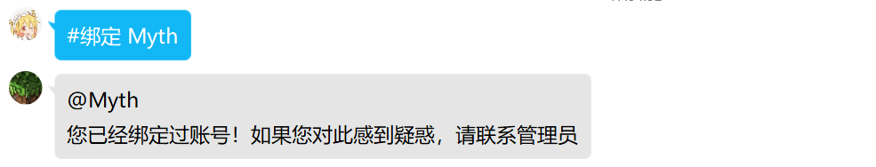
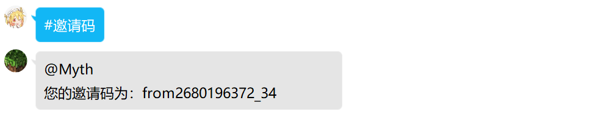
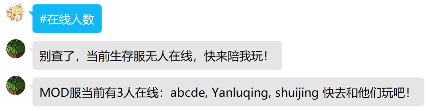
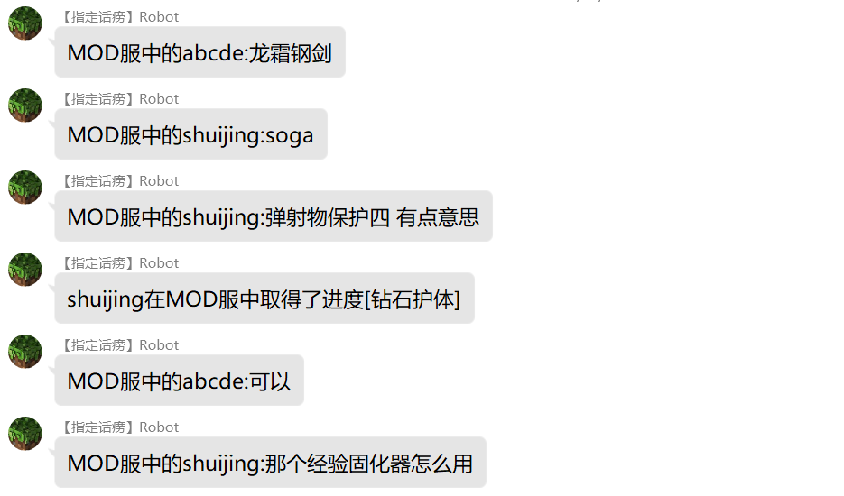
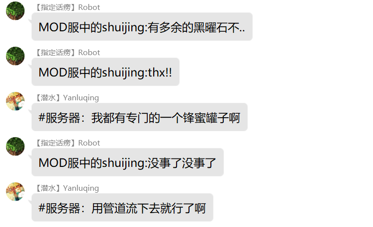
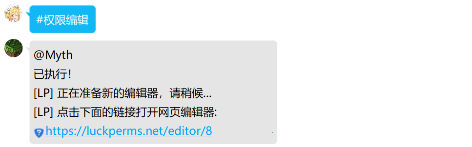
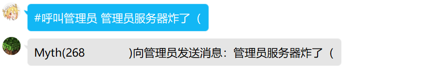
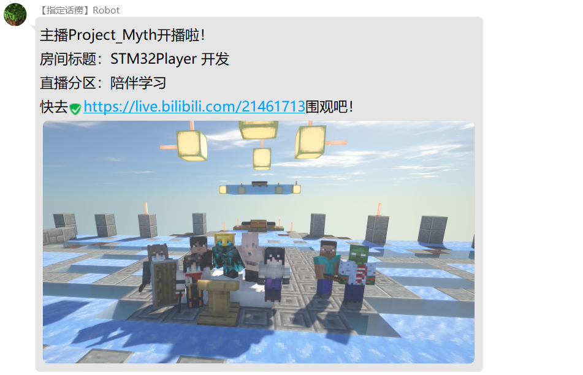

# 功能介绍

## 入群欢迎

在新的玩家加入服务器 QQ 群后，机器人会 @玩家 并发送一条入群欢迎消息。您可以在配置文件中指定入群欢迎的内容，如：

+ 服务器的地址
+ 客户端的下载方式
+ 提示玩家加机器人为好友以支持更多功能
+ 提示玩家将 QQ 号和游戏角色绑定
+ 提示玩家输入指令查看机器人帮助

## 绑定 QQ

为了支持更多功能，玩家需要将 QQ 号和游戏角色绑定。可以通过 #绑定 ID 这样命令实现 QQ 号和游戏角色的关联。

通过配置，还可以在未绑定账号的玩家每次进入服务器时，在游戏中向他们发送消息，提示他们绑定 QQ 号。

## 发送邀请码

您可以将 AkashicQQ 和您的 [Blessing Skin Server](https://github.com/bs-community/blessing-skin-server) 对接，实现在 QQ 群中申请皮肤站的邀请码。您可以通过配置文件指定每个玩家的默认申请次数，也可以手动调整他们的申请余量。管理员可以向机器人无限索要邀请码。

## 多服务器支持、多服务端支持

AkashicQQ 通过作者的另一个程序 [Prism Console](https://github.com/Mythologyli/Prism) 与 Minecraft 服务器通信。您可以将多个服务器同时接入 AkashicQQ，实现跨服聊天等功能。

不仅如此，得益于 Prism Console 使用管道与 Minecraft 通信的特点，AkashicQQ 支持原版、Spigot、Paper、Forge、Fabric、Sponge 等多种服务端，而不依赖于插件或模组环境。与插件和模组不同，AkashicQQ 在实现功能的同时几乎不会对您的服务器性能造成任何影响。当您对 AkashicQQ 进行修改甚至重启时，您也无需重启游戏服务器。

## 服务器在线人数查询

通过类似 #在线人数 的命令，您的玩家可以在 QQ 中查询所有服务器的在线人数。

## 服务器事件广播

通过配置，你可以将服务器中的如下事件广播至 QQ 群：

+ 服务器开启
+ 服务器关闭
+ 玩家加入服务器
+ 玩家退出服务器
+ 玩家聊天
+ 玩家获得成就

在添加多服务器后，以上信息也会在其他服务器中广播。也就是说，您可以借助 AkashicQQ 直接实现跨服聊天等功能，而无需其它插件或模组。

## 服务器 <-> QQ 群双向聊天

在 QQ 群中发送类似 #服务器 消息 的指令，可将消息发送至所有连接至 AkashicQQ 的 Minecraft 服务器。

由于服务器中玩家的聊天消息会自动发送至 QQ 群，您可以借此实现服务器与 QQ 群的双向聊天。

另外，由于玩家的 QQ 号已经和游戏角色绑定，服务器中的玩家可以看到消息发送者的游戏 ID 而非群名片。

## 向指定玩家私聊消息

## 向指定服务器发送命令

具有权限的 QQ 号可以向特定服务器发送命令。命令将在服务器控制台执行，并可以将结果返回给您。您也可以为特定命令配置别名，并指定哪些人有权执行命令。

您可以借此配合其他插件实现以下功能：

+ 在 QQ 中查看服务器 TPS
+ 在 QQ 中编辑服务器权限设置
+ 在 QQ 中查看 PAPI 变量
+ ......

## 呼叫管理员

通过类似 #呼叫管理员 消息 的命令，您的玩家可以借助 AkashicQQ 向所有管理员发送消息。消息会同时在游戏内和 QQ 中向管理员私发。再也不担心您的玩家找不到管理员啦！

## 管理员接收提醒

当您的玩家执行了获取邀请码、呼叫管理员等操作后，所有管理员将收到相应提醒。这可以让服务器管理更加便捷。

## 掉线提示

通过配置，AkashicQQ 可以在玩家下线时向他们的 QQ 私发消息。再也不担心挂机掉线了！

## 哔哩哔哩直播提醒

通过配置，您可以让 AkashicQQ 在指定直播间开播时向群内发送提醒。
