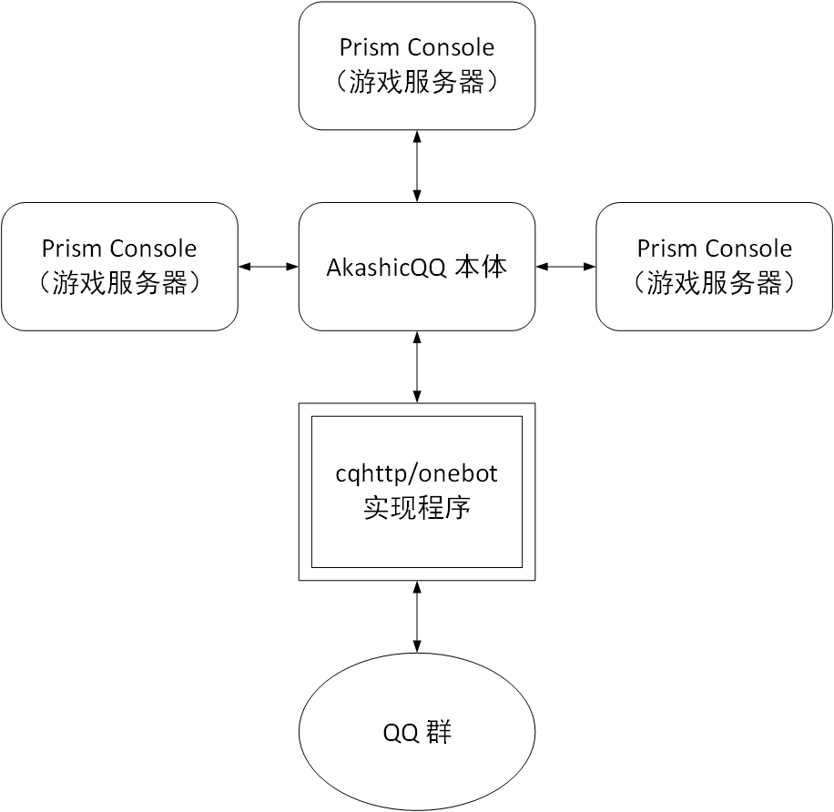
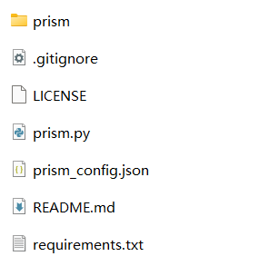
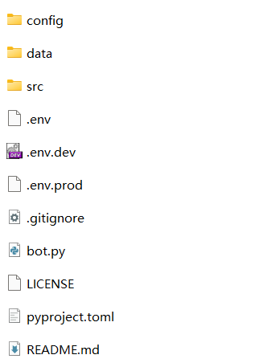

# 安装

在介绍如何安装 AkashicQQ 前，我们对 AkashicQQ 的架构进行一下介绍，这将有助于我们理解 AkashicQQ 的安装过程。

## AkashicQQ 架构

AkashicQQ 由以下几个模块构成，模块之间通过网络连接：

+ [AkashicQQ 机器人本体](https://github.com/Mythologyli/AkashicQQ)（一个 Python 程序）
+ [Prism Console](https://github.com/Mythologyli/Prism)（一个 Python 程序）
+ cqhttp(onebot) 协议实现程序，如 [go-cqhttp](https://github.com/Mrs4s/go-cqhttp)、[onebot-kotlin](https://github.com/yyuueexxiinngg/onebot-kotlin)、[OneBot-YaYa](https://github.com/Yiwen-Chan/OneBot-YaYa) 等等

可能有读者觉得模块太多，但正是这样的实现增强了 AkashicQQ 的可拓展性、可自定义性，提升了 AkashicQQ 的性能。你甚至可以将三个模块安装在三个服务器上，自由地分配服务器性能。

Prism Console 与每个 Minecraft 服务器安装在一起。安装了 Prism Console 后，它将接管您的服务器控制台，以实现上报消息、执行命令等功能。

AkashicQQ 可以安装在任意位置，只要此位置能与每个 Prism Console 通过网络连接。AkashicQQ 负责异步地接收、处理 Prism Console 上报的消息，并控制 Prism Console 的行为。

AkashicQQ 并不能直接与腾讯的服务器通讯，而要借助 cqhttp(onebot) 协议实现程序。AkashicQQ 与 cqhttp(onebot) 协议实现程序交换信息，后者将信息与 QQ 群交换。您的机器人 QQ 号就是在 cqhttp(onebot) 协议实现程序上登录的。同样，cqhttp(onebot) 协议实现程序可以安装在任意位置，只要此位置能与 AkashicQQ 通过网络连接。

您当然可以将这三个模块安装在同一台服务器上。这三个模块都可以在 Windows 或 Linux 上运行，您无需担心平台问题。

## 安装前的准备

+ 一个 QQ 账号，用于充当机器人。请确保此 QQ 号为您的服务器群的管理员。

## 安装 Prism Console

> 注意：Prism Console 需要与您的 Minecraft 服务器安装在一起

1. 为了安装 Prism Console，您需要首先安装 [Python](https://www.python.org/) 环境。推荐安装 Python 3.8+

    + Windows

        在 Python 官网上下载 Python3 并安装。注意在安装时勾选添加 Python 至系统 PATH。

        Python 3.8.10 64位 [官方下载链接](https://www.python.org/ftp/python/3.8.10/python-3.8.10-amd64.exe)

    + Linux

        您可以使用您的包管理器安装 Python 环境，例如 `sudo apt install python3 python3-pip`。请一并安装 pip。

2. 通过[下载链接](https://hub.akashic.cc/Myth/Prism/archive/main.zip)下载 Prism Console。解压得到如下内容：

    

3. 将 prism 文件夹、prism.py、prism_config.json、requirements.txt 文件复制到服务器根目录下。

4. 编辑 prism_config.json。

    > 注意：请使用 UTF-8 编码打开和保存 JSON 文件。

        {
            "level": "DEBUG",
            "shell": {
                "start_cmd": "./start.sh",
                "stop_cmd": "stop",
                "read_encoding": "utf-8",
                "write_encoding": "utf-8"
            },
            "api": {
                "address": "127.0.0.1",
                "port": 8520,
                "tag": "主服"
            },
            "webhook": {
                "url": "http://127.0.0.1:8080/",
                "tag": "主服",
                "event": {
                    "ServerStart": true,
                    "ServerStop": true,
                    "PlayerJoin": true,
                    "PlayerQuit": true,
                    "PlayerChat": true,
                    "PlayerAdvancement": true
                }
            }
        }

    + `level`：调试等级，可为 DEBUG 或 INFO。建议保持 DEBUG，方便安装期间定位问题。

    + `shell`：命令行相关配置。

        + `start_cmd`：服务器启动命令。可以是 `java -jar server.jar` 之类的命令，也可以是 start.bat ./start.sh 之类的脚本。
        + `stop_cmd`：服务器关闭命令。一般无需更改。
        + `read_encoding`：读命令行时采用的编码。一般在中文版 Windows 上填写 gbk，Linux 上填写 utf-8。
        + `write_encoding`：写命令行时采用的编码。一般在中文版 Windows 上，Spigot 系服务器填写 gbk，Forge 系服务器填写 utf-8。Linux 上填写 utf-8。

            > 注意：当出现游戏内消息乱码、控制台输入输出乱码时，请尝试更改以上两个配置项。

    + `api`：API 相关配置。

        + `address`：API 绑定的 IP 地址。如果 Prism Console 和 AkashicQQ 安装在一起可以填写 127.0.0.1。
            
            > 注意：当 `address` 项设置为 0.0.0.0 时，API 可能暴露在公网上，请通过配置防火墙的方式确保安全。
        
        + `port`：API 绑定的端口。
        + `tag`：服务器的 tag。请填写唯一、可读的名称（如“主服”），每个 Prism Console 的 tag 不能相同。

    + `webhook`：Webhook 相关配置。

        + `url`：服务器事件上报地址，即 http://{AkashicQQ 的 IP}:{AkashicQQ 的端口}。
        + `tag`：与上面的 `tag` 保持一致。
        + `event`：哪些事件会被上报。无需更改。

5. 将服务器根目录在终端中打开。在命令行输入 `pip3 install -r requirements.txt` 安装依赖。

    > 提示：[如何将当前文件夹在终端打开？](https://jingyan.baidu.com/article/1974b289c2e6f6f4b0f77466.html)
    
    > 提示：pip3 连接缓慢？[为 pip3 更换软件源](https://www.cnblogs.com/chenlizhi/p/13742163.html)

6. 命令行输入 `python3 prism.py`(Linux) 或 `python prism.py`(Windows) 运行 Prism Console。不出意外，您的服务器将正常启动。

    > 提示：看不见服务器启动的输出？检查服务器启动命令。

    > 提示：AkashicQQ 官方交流群：433142833

7. 如果您有其它服务器，请重复此过程，为每个服务器配置 Prism Console。

## 安装 cqhttp(onebot) 协议实现程序

推荐安装 [go-cqhttp](https://docs.go-cqhttp.org/)。您也可以选用其它的 cqhttp(onebot) 协议实现程序。

请配置为反向 Websocket 通信方式，并在配置文件中填写机器人的 QQ 号、密码。

在 ws-reverse 配置项中，请将 universal 地址设置为 ws://{AkashicQQ 的 IP}:{AkashicQQ 的端口}/cqhttp/ws，例如：ws://127.0.0.1:4399/cqhttp/ws。

> 提示：安装遇到困难？请阅读 go-cqhttp 的[文档](https://docs.go-cqhttp.org/)，也可在 AkashicQQ 官方交流群（官方交流群：433142833）下载懒人包。

## 安装 AkashicQQ 本体

1. 完成以上准备后，我们可以开始 AkashicQQ 本体的安装了。您同样需要安装 Python 环境。如果您安装 AkashicQQ 的服务器与 Prism Console 相同，则不用再次安装。否则，您可能需要重复一遍安装 Python 环境的过程。

2. 通过[下载链接](https://hub.akashic.cc/Myth/AkashicQQ/archive/main.zip)下载 AkashicQQ。解压得到如下内容：

    

3. 同样，将此目录在终端中打开。在命令行输入 `pip3 install -r requirements.txt` 安装依赖。

4. 请先查阅[配置文件](config)部分完成配置。

5. 在终端使用 `nb run` 运行 AkashicQQ。